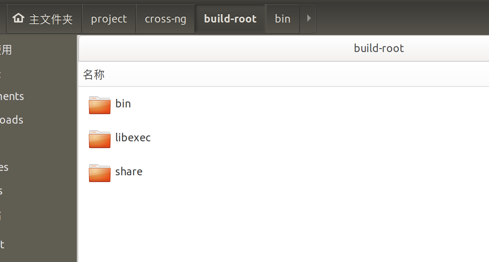
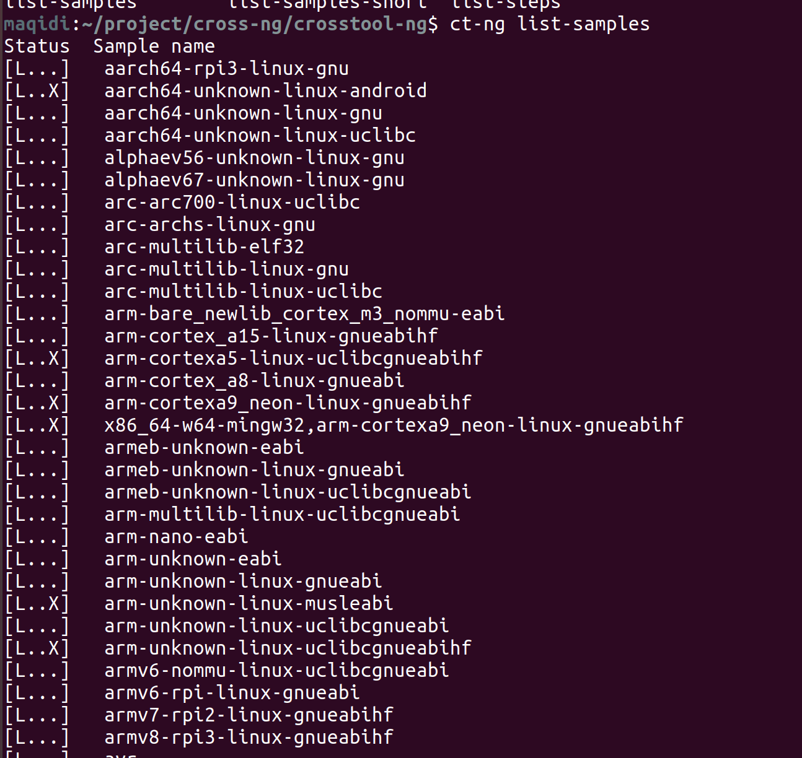
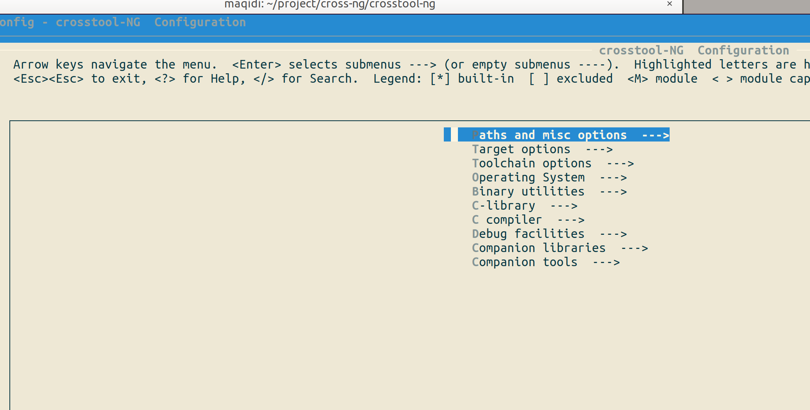
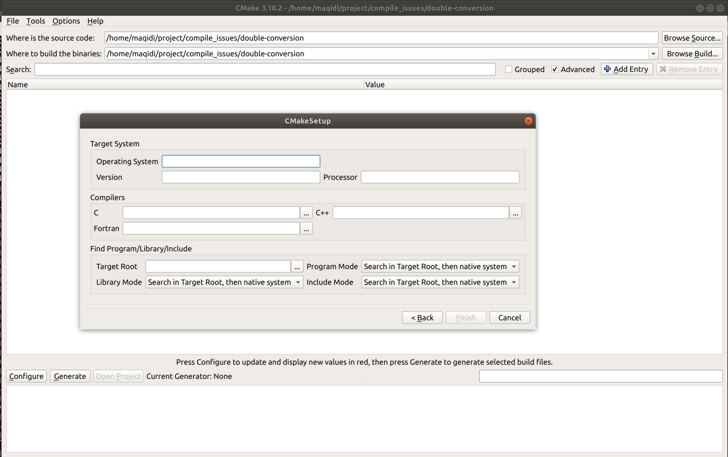
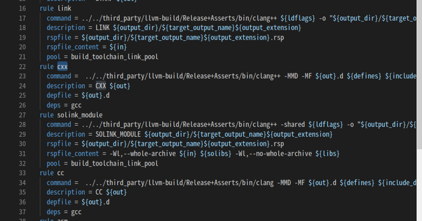

# 交叉编译
## 什么是交叉编译
本地编译

本地编译可以理解为，在当前编译平台下，编译出来的程序只能放到当前平台下运行。平时我们常见的软件开发，都是属于本地编译：
比如，我们在 x86 平台上，编写程序并编译成可执行程序。这种方式下，我们使用 x86 平台上的工具，开发针对 x86 平台本身的可执行程序，这个编译过程称为本地编译。

交叉编译

交叉编译可以理解为，在当前编译平台下，编译出来的程序能运行在体系结构不同的另一种目标平台上，但是编译平台本身却不能运行该程序：

- build：构建 gcc 编译器的平台系统环境，编译该软件使用的平台。
- host:：是执行 gcc 编译器的平台系统环境，该软件运行的平台。
- target：是让 gcc 编译器产生能在什么格式运行的平台的系统环境，该软件处理的目标平台。

现在常用的交叉编译链，大部分都是 build=host=x86_64;  target=arm/mips

## 交叉编译的作用

- 某些设备资源有限无法运行编译器，例如一些单片机，显然不能指望它自己编译程序，它的资源有限到甚至系统都没有；
- 需要对一套代码编译出在不同平台运行的版本，比如你想让你的程序可以运行在Windows，Ubuntu，Mac等不同系统，又不想在每一种上配置一遍编译环境；
- 可以多台机器并行编译，提高效率；
- 为刚出现的机器编译它的系统和编译器等。

# 交叉编译链
编译过程是按照不同的子功能，依照先后顺序组成的一个复杂的流程
编译过程包括了预处理、编译、汇编、链接等功能。既然有不同的子功能，那每个子功能都是一个单独的工具来实现，它们合在一起形成了一个完整的工具集。
同时编译过程又是一个有先后顺序的流程，它必然牵涉到工具的使用顺序，每个工具按照先后关系串联在一起，这就形成了一个链式结构,也就是常说的交叉编译链。

## 命名规则
一般来说，交叉编译工具链的命名规则为：arch-core-kernel-system-language。其中：

- arch：体系架构，如ARM，MIPS，等，表示该编译器用于哪个目标平台；

    - arm/arm64/aarch64/armel/armhf/... 表示arm(64位)平台,arm的工具链根据硬件的要求，会有比较多的定制。 
    - mips/mipsel/mips64el 表示 mips(64位)平台，el 表示小端，不带el的mips是大端
    - x64/i386/amd64 表示x86平台 
- core：使用的是哪个CPU Core，如Cortex A8；或者是指定工具链的供应商。如果没有特殊指定，则留空不填。这一组命名比较灵活，在某些厂家提供的交叉编译链中，- 有以厂家名称命名的，也有以开发板命名的，或者直接是none或cross的；
- kernel： 所运行的OS，见过的有Linux，uclinux，bare（无OS）

    - uClinux是针对控制领域的嵌入式linux操作系统，它从Linux 2.0/2.4内核派生而来，沿袭了主流Linux的绝大部分特性。适合不具备内存管理单元(MMU)的微处理器/微控制器，没有MMU支持是 uClinux与主流Linux的基本差异。
    - bare-metal，直译为：裸金属。 
          表示：无（此处主要指的是Linux）操作系统的环境， 
          比如，用此交叉编译器，去编译一个Uboot，或者是其他一个小程序，是运行在，无嵌入式Linux的时候，单独运行的一个程序。
- abi：交叉编译链所选择的库函数和目标映像的规范，如gnu，gnueabi等。
- language：编译语言，表示该编译器用于编译何种语言，常见的有gcc，g++，as

## ABI
ABI，全称（Application Binary Interface），是一套说明程序如何在某个平台上运行的规则。平台的开发者定制这套规则，这个平台可以是硬件平面，也可以是操作系统层面。定制这个规则的主要目的让编译器了链接器知道如何去编译链接程序，让他们能够按照预期在平台上运行，也使得不同程序之间的交互成为可能。这里不同的程序可以是不同语言编写的程序编译成的二进制文件，也可以是同种语言编译成的库文件，还可以是同一个程序内部不同的函数调用。

- 定义了函数调用标准，这是最核心的一套规则，它规定了如何将你调用一个函数这一行代码翻译成机器代码；
- 指导如何表示一个需要暴露的函数，也称之为“改名（name mingling）”；
- 定义可以数用那些数据类型，以及它们在内存中的布局。每种数据类型占用多少个字节，数据是大端格式还是小端，等等。这些都需要一个标准，不然不用说不同语言之间相互不能交互，就连同一种语言不同编译器编译出来的二进制都可能不同。
- 堆栈的结构和行为方式等多个方面，比如栈向上还是向下生长等等。

### 常见abi
- arm，根据gcc的选项 -mfloat-abi 的选项，有gnueabi/gnueabihf 的区别。-mfloat-abi有三种值soft,softfp,hard(其中后两者都要求arm里有fpu浮点运算单元,soft与后两者是兼容的，但softfp和hard两种模式互不兼容)

    - soft: 不用fpu进行浮点计算，即使有fpu浮点运算单元也不用,而是使用软件模式。
    - softfp : armel架构(对应的编译器为gcc-arm-linux-gnueabi)采用的默认值，用fpu计算，但是传参数用普通寄存器传，这样中断的时候，只需要保存普通寄存器，中断负荷小，但是参数需要转换成浮点的再计算。
    - hard: armhf架构(对应的编译器gcc-arm-linux-gnueabihf)采用的默认值，用fpu计算，传参数也用fpu中的浮点寄存器传，省去了转换, 性能最好，但是中断负荷高。
- gnu等价于glibc+oabi；gnueabi等价于glibc+eabi。若不指定，则也可以留空不填
- multilib,可支持其它abi的版本，最常见的是支持32位的64位abi
- uclib,glib的一个简化版

例如 

- `mips64el-longsoon-linux-gnu-g++` 表示该编译器是 64位arm平台，芯片厂商为龙芯，目标操作系统为 linux，abi 接口规范为gnu的 g++编译器。
- `build/toolchain/linux/BUILD.gn` chromium 使用的交叉编译链

## 交叉编译链构成
1. GNU C Library，也就是通常所说的**glibc**，另外在嵌入式领域，往往采用glibc兼容的uclibc、newlib等。glibc是由GNU项目提供的标准C运行库，它针对PC应用设计，较庞大，但能提供最优的兼容性。如果一般的嵌入式开发可选用uClibc。uClibc原本是uCLinux开发过程中的一个C语言库，现已经独立于uCLinux项目并且进一步完善。它对glibc的大部分函数进行了重写，并且目标就定位于嵌入式，所以其相对glibc而言要小巧很多。此外由于它的函数与glibc保持一致，这样很多原本基于glibc开发的软件基本无需改动便可改用uClibc编译运行，使得在嵌入式系统上占用的内存和磁盘空间更少。但由于毕竟不是标准的C运行库，因此uClibc拥有着一定的兼容性问题。 Newlib是一个面向嵌入式系统的C运行库.最初是由Solutions收集组装的一个源代码集合,取名为newlib, 现在由Red Hat维护,对于与GNU兼容的嵌入式C运行库,Newlib并不是唯一的选择,但是从成熟度来讲,newlib是最优秀的.newlib具有独特的体系结构,使得它能够非常好地满足深度嵌入式系统的要求.newlib可移植性强, 具有可重入特性,功能完备等特点,已广泛应用于各种嵌入式系统中.
2. 编译工具GNU Compiler Collection (GCC)，
3. 二进制实用程序Binutils (GNU binary utilities)，其中包括：objdump、readelf、strip、ar、nm、ldd、ngprof、gcov等。
4. 调试工具GNU Remote Debugger (GDB) [optional]
5. GNU make [optional]
6. 内核调试工具kgdb. [optional]
7. 从广义上来讲，GNU的工具链还包括如下几个单元：

    1. GNU代码编辑器(vi, emacs, vim etc.)
    2. GNU自动化工具，旨在提高程序可移植性。

## 获取交叉编译链
使用其他人针对某些CPU平台已经编译好的交叉编译链。我们只需要找到合适的，下载下来使用即可。

常见的交叉编译链下载地址：

- 在 http://ftp.arm.linux.org.uk/pub/armlinux/toolchain/ 下载已经编译好的交叉编译链
- 在 http://www.denx.de/en/Software/WebHome 下载已经编译好的交叉编译链
- 在 https://launchpad.net/gcc-arm-embedded 下载已经编译好的交叉编译链
- 一些制作交叉编译链的工具中，包含了已经制作好的交叉编译链，可以直接拿来使用。如crosstool-NG
- 如果购买了某个芯片或开发板，一般厂商会提供对应的整套开发软件，其中就包含了交叉编译链。

# crosstool
## crosstool 环境搭建
- 编译、安装
        cd /home/maqidi/project/cross-ng
        git clone https://github.com/crosstool-ng/crosstool-ng
        cd crosstool-ng
        ./bootstrap
        ./configure --prefix=/home/maqidi/project/cross-ng/build-root/
        >> 注意查看configure是否执行成功，一般执行失败是因为缺少一些package。

        make 
        make install

执行成功后，目录结构如下 

- 把ct-ng配置到PATH

        export PATH="${PATH}:/home/maqidi/project/cross-ng/build-root/bin"

- 配置自动补齐

        echo "source /home/maqidi/project/cross-ng/crosstool-ng/bash-completion/ct-ng" >> ~/.bashrc

>> 这一步执行完成后，键入 ct-ng 双tab后， 会列出可用的命令，并且在执行这些命令时，ct-ng能够补齐这些命令的参数。
- 一些常用命令
    - help 显示帮助文档，也可以用 `man ct-ng` 替代
    - menuconfig 配置一个交叉编译环境
    - list-samples
    - show-arm-unknown-linux-gnueabi

### 搭建交叉编译环境
>> 假定我需要在一个x64的主机上搭建一个麒麟-飞腾(arm64) 的编译环境。

- 第一步，需要配置arm64的环境，ct 提供了一些常用的配置，最好在它们的基础上进行修改
    
    ct-ng list-samples

>> 交叉编译工具链的命名规则为：arch [-vendor] [-os] [-(gnu)eabi]

    arch – 体系架构，如ARM，MIPS
    vendor – 工具链提供商
    os – 目标操作系统
    abi – 应用二进制接口（Application Binary Interface）

- 第二步，选择 arm-unknown-linux-gnueabi 配置

        ct-ng show-arm-unknown-linux-gnueabi
        ct-ng arm-unknown-linux-gnueabi
        ct-ng menuconfig

- 执行 `ct-ng menuconfig`， 会进入交叉编译环境的配置界面，在这里配置自己的交叉编译环境。

这些选项对应于ct-ng 的变量，ct-ng可以使用系统的变量，以及自己的变量，使用方式为 ${VAR}。

常用的变量包括

- CT_TARGET 目标编译器的名称。
- CT_LOCAL_TARBALLS_DIR 已有的源码路径，用于编译编译器所需要的package
- CT_PREFIX_DIR 交叉编译器的安装路径
- CT_TARGET_ARCH
- CT_TARGET_VENDOR 会影响编译器名称的vendor 字段。
- CT_TOP_DIR 

这些变量的值可以在 .config 文件中找到。${pwd}/.config 保存当前的配置,从这个意义上来说，.config 很类似visual studio的proj.user文件； 如果需要复用自己的配置，应该把它保存到另外的路径下；这样以后在使用时，可以把它加载到.config 中。

- 第二步执行 ct-ng build

## 使用 crosstool 编译

最简单的情况下，把gcc所在路径添加到PATH，然后执行编译即可。

这种情况适用于不涉及第三方库、并且代码体量比较小的情况。

如果代码量比较大，一般会使用一些构建工具，这些工具会自动配置依赖关系，并间接调用 gcc

## 在交叉编译中使用构建工具 autoconf/cmake/make
编译过程是整条编译链协作的过程，一般会使用构建工具去管理。常用的构建工具包括:
- Make
- Cmake
- Autoconf
- Ninja

### Makefile
在Makefile中使用交叉编译工具，一般Makefile中会使用cc(CC)变量指代C编译器，cxx(CXX)变量指代C++编译器，需要找到相应位置，修改这些变量值。
以编译 bzip2 为例，可以直接修改Makefile，也可以执行以下命令，覆盖CC/AR 等变量

    make CC="aarch64-uos-linux-gnu-gcc -fPIC" AR="aarch64-uos-linux-gnu-ar" RANLIB="aarch64-uos-linux-gnu-ranlib"
    make CC="aarch64-uos-linux-gnu-gcc -fPIC" AR="aarch64-uos-linux-gnu-ar" RANLIB="aarch64-uos-linux-gnu-ranlib" install PREFIX=/home/maqidi/x-tools/aarch64-uos-staging 

有时候，需要手动为编译器指定一下sysroot，尤其是交叉编译器和sysroot 来自于不同的来源。(在该例中不需要，因为交叉编译器是我们自己构建的，它的编译选项中已经制定了sysroot位置)

    -sysroot=dir

### Cmake
CMake有GUI交互工具，简单配置即可。

### Autoconf
需要指定host/target，以及cc,有些时候可能还需要手动指定 ar/as/runlib 等工具

以ffmpeg为例

    strip=/home/maqidi/x-tools/aarch64-uos-linux-gnu/aarch64-uos-linux-gnu/bin/strip cc=aarch64-uos-linux-gnu-gcc ./configure --prefix=/home/maqidi/x-tools/mplayer --cc=aarch64-uos-linux-gnu-gcc --ar=aarch64-uos-linux-gnu-ar --ranlib=aarch64-uos-linux-gnu-ranlib --as=aarch64-uos-linux-gnu-as  --enable-static --extra-cflags="-I/home/maqidi/x-tools/aarch64-uos-staging/include -fPIC" --enable-cross-compile --extra-ldflags="-L/home/maqidi/x-tools/aarch64-uos-staging/lib -L/home/maqidi/x-tools/aarch64-uos-staging/usr/lib"  --enable-armv6t2 --target=aarch64-linux --enable-ffmpeg_a --enable-ffmpeg_so 

### ninja
输入是 build.ninja 文件, 自定义rule的command字段。
>> 对于chromium工程来说，工具链的定义在 toolchain.ninja 里面。

## [交叉编译Qt](crosscompile-qt.md)

## 申威交叉编译环境搭建

## linux 相关问题总结
1. `version 'Qt_5.3' not found ` 
    >> 使用高版本Qt编译的程序，运行在Qt版本比较低的环境里。 
    解决方法：
    从脚本运行程序，并在脚本里面重定义 LD_LIBRARY_PATH
2. `cannot find library components.so`
    >> 跟windows不一样的是，linux进程加载动态链接库时，默认并不搜索可执行文件所在路径。 
    解决办法：
    LDFLAGS="-Wl,-rpath '-Wl,\$\$ORIGIN'"  ORIGIN被链接器理解为执行体所在目录
3. `./chrome: No such file or directory`
    >> linux没有识别可执行程序，原因可能性很多。
    1. 先用 `ls -al ./chrome` 看它是否有可执行权限
    2. 用 `file ./chrome` 看它是否是当前系统识别的格式
    3. 如果是该平台下32位的程序，则需要添加32位ABI支持： `sudo apt install libc6-i386`
    4. 如果是其它平台下的程序，则不用考虑。

# 参考文档
- **ct-ng** https://crosstool-ng.github.io/docs
- **uclibc和glibc的差别** http://blog.chinaunix.net/uid-20593827-id-1918476.html
- **binutils介绍** https://sourceware.org/binutils/
- **libc版本差异** https://www.crifan.com/relation_between_uclibc_glibc_eglibc/
- **glibc各个库介绍** https://www.cnblogs.com/cute/archive/2011/05/03/2035645.html

# PART II [chromium sysroot](chromium-sysroot.md)
